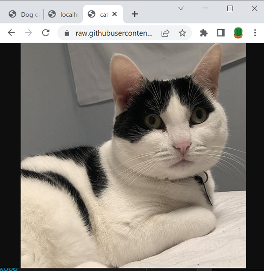
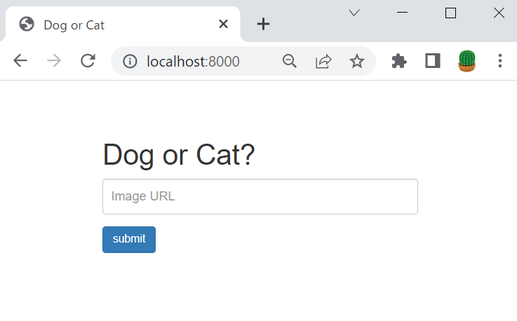

# TensorFlow を使用して Azure Functions で機械学習モデルを適用する

試してみる

基本的にはこのチュートリアルの内容になります。
https://docs.microsoft.com/ja-jp/azure/azure-functions/functions-machine-learning-tensorflow?tabs=bash

## 概要

機械学習モデル(TensorFlow)を利用して、画像を分類するAPIをAzure Functionsに実装します。
※利用するモデル は Azure Custom Vision Service でトレーニングされエクスポートされたモデル 
※Azure Custom Vision Serviceについては別途調査が必要

## version
```
func version 
4.0.4590
python --version 
Python 3.7.13
```

## 利用する python ライブラリ
```
azure-functions
tensorflow==1.14
Pillow
requests
```

## 構築手順
python 仮想環境の作成
```
cd 08_az_func_tensorflow
python -m venv .venv
source .venv/bin/activate
```

azure functions の作成
```
func init --worker-runtime python
func new --name classify --template "HTTP trigger"
func start
# 確認
curl http://localhost:7071/api/classify
```

[チュートリアル リポジトリ](https://github.com/Azure-Samples/functions-python-tensorflow-tutorial) を利用して動作検証を行いました。ファイル構成は以下の通りです。

```
tree  -L 2
.
├── classify ※追加した関数
│   ├── __init__.py
│   ├── __pycache__
│   ├── function.json
│   ├── labels.txt　※ラベルファイル
│   ├── model.pb　※モデルファイル
│   └── predict.py ※モデルファイルとラベルファイルを読み込んでtensorFlowモデルを利用して予測を行います。
├── frontend
│   └── index.html
├── host.json
├── local.settings.json
├── requirements.txt
:
```

## predict.pyの解説

curl で動作確認  
※[画像URL](https://raw.githubusercontent.com/Azure-Samples/functions-python-tensorflow-tutorial/master/resources/assets/samples/cat1.png)は以下のようなイメージです。

```
curl http://localhost:7071/api/classify?img=https://raw.githubusercontent.com/Azure-Samples/functions-python-tensorflow-tutorial/master/resources/assets/samples/cat1.png
{"created": "2022-09-20T00:36:04.115632", "predictedTagName": "cat", "prediction": [{"tagName": "cat", "probability": 1.0}]}
```
予測結果(PredictTag)は猫として判定されています。

## Frontendのサンプル (vue js利用)
vue jsを利用した簡単なサンプルが用意されています。
```
cd frontend
python -m http.server
```
テスト用のwebサーバーを起動してブラウザで http://localhost:8000/ へアクセスすると以下のような画面が表示されます。


# まとめ
今回は機械学習のモデルデータをWeb API(Azure Functions)に取り込む方法の検証でした。MSのチュートリアルに従ってチュートリアルを動作させてることは簡単にでき機械学習のモデルを利用したAPIを作成することはそれほど難しくなさそうであることが分かりました。いろいろな機械学習モデルを利用したAPIの開発に挑戦してみてはいかがでしょうか。

ただし、応用的に利用して行くためにはやはり機械学習や周辺ライブラリ(今回の場合はTensorFlow)などの知識が必要になります。
また、今回利用したモデルは Azure Custom Vision Service を利用して作成されたモデルだったのですが、モデルの作成についても今後調査していきたいと思います。
