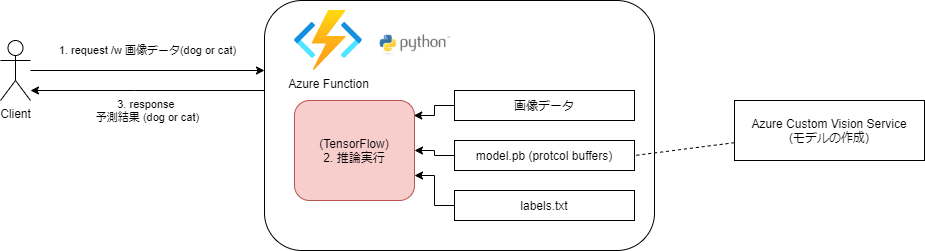

# Azure で TensorFlow (モデル) を利用する

# はじめに

こんにちは、ACS事業部の奥山です。

Azure での 機械学習モデル(TensorFlow) の利用についての検証を行いましたので備忘録も兼ねてブログにしておきます。  

基本的にはMicrosoftの[チュートリアル](https://docs.microsoft.com/ja-jp/azure/azure-functions/functions-machine-learning-tensorflow?tabs=bash)の内容の紹介になります。Azure Functionsを利用して簡単に機械学習の機能を搭載したAPIが作成できます。

## 概要

機械学習モデル(TensorFlow)を利用して、画像を分類するAPIをAzure Functionsに実装します。
以下の図の様にFunctions(Python)にTensorflowのモデルを含めて推論処理を実行します。


1. Clientはイメージデータ(犬か猫の画像)をAzure Functionsへ渡します。
2. Azure Functionsは受け取ったイメージデータとモデルデータを使って推論を実行します。
3. 推論結果をClientに返します。

※モデルデータはProtocolBuffer形式のバイナリファイルになります。
※利用するモデル は Azure Custom Vision Service でトレーニングされエクスポートされたモデルになります。 Azure Custom Vision Serviceについては別途検証しようと思います。  

## 検証で利用した pythonライブラリ や version情報

version情報
```
func version 
4.0.4590
python --version 
Python 3.7.13
```

pythonライブラリ (requirements.txt)
```
azure-functions
tensorflow==1.14
Pillow (画像処理ライブラリ)
requests (HTTP ライブラリ)
```

## 構築手順

### 1. Functionsの作成

python 仮想環境の作成
```
cd az_func_tensorflow
python -m venv .venv
source .venv/bin/activate
```

azure functions を新規作成し、HttpTrigger関数を実装します。
```
func init --worker-runtime python
func new --name classify --template "HTTP trigger"
func start
# 確認
curl http://localhost:7071/api/classify
```

### 2. [チュートリアル](https://docs.microsoft.com/ja-jp/azure/azure-functions/functions-machine-learning-tensorflow?tabs=bash)に従い関数にヘルパー関数(TensorFlowを利用する処理)を実装します。
完成したファイルは以下のようになります。
```
tree  -L 2
.
├── classify ※追加した関数
│   ├── __init__.py
│   ├── __pycache__
│   ├── function.json
│   ├── labels.txt　※ラベルファイル
│   ├── model.pb　※モデルファイル (Protocol Buffers形式)
│   └── predict.py ※モデルファイルとラベルファイルを読み込んでtensorFlowモデルを利用して推論を実行
├── frontend
│   └── index.html ※確認用の簡易のWEBアプリ(vue js)
├── host.json
├── local.settings.json
├── requirements.txt
:
```

### predict.pyの解説
predict.py には画像処理の部分が多く含まれていますが、TensorFlow の**初期化処理**と**推論の実行**について少しみてみたいと思います。

####  初期化処理
初期化処理(_initialize)は初回の一度だけ TensorFlowモデル(model.pb) をディスクから読み込み、グローバル変数内にキャッシュされるように実装されています。2回目以降はこのキャッシュを利用することで高速化されます。  
※初期化処理はローカル環境で実行していると0.5～1.0秒程度

```
def _initialize():
    global labels, network_input_size
    if not labels:
        logging.info('start _initialize...')
        # モデル(ProtcolBuffers形式ファイル)の読み込み
        with tf.io.gfile.GFile(filename, 'rb') as f:
            graph_def.ParseFromString(f.read())
            tf.import_graph_def(graph_def, name='')
            #logging.info(graph_def)            
        # ラベルの読み込み
        with open(labels_filename, 'rt') as lf:
            labels = [l.strip() for l in lf.readlines()]
            logging.info(labels)
        with tf.compat.v1.Session() as sess:
            input_tensor_shape = sess.graph.get_tensor_by_name('Placeholder:0').shape.as_list()
            network_input_size = input_tensor_shape[1]
            logging.info('network_input_size = ' + str(network_input_size))
```

#### 推論の実行
Session経由で推論を実行し、推論結果が最も高いものを結果として返します。
```
def _predict_image(image):
    try:
:
        tf.compat.v1.reset_default_graph()
        tf.import_graph_def(graph_def, name='')

        with tf.compat.v1.Session() as sess:
            prob_tensor = sess.graph.get_tensor_by_name(output_layer)

            predictions, = sess.run(prob_tensor, {input_node: [cropped_image] })
            # predictions に推論結果が配列で格納されます 
            # ※ 例:[1.0000000e+00 3.6953815e-10] 猫、犬の順番で格納

            result = []
            highest_prediction = None
            for p, label in zip(predictions, labels):
                truncated_probablity = np.float64(round(p,8))
                if truncated_probablity > 1e-8:
                    prediction = {
                        'tagName': label,
                        'probability': truncated_probablity }
                    result.append(prediction)
                    if not highest_prediction or prediction['probability'] > highest_prediction['probability']:
                        # 推論結果が最も高いデータを選択します
                        highest_prediction = prediction

            response = {
                'created': datetime.utcnow().isoformat(),
                'predictedTagName': highest_prediction['tagName'],
                'prediction': result 
            }

            _log_msg("Results: " + str(response))
            return response
:
```

## 動作確認 (curl)
※[サンプル画像URL](https://raw.githubusercontent.com/Azure-Samples/functions-python-tensorflow-tutorial/master/resources/assets/samples/cat1.png)はブラウザで確認すると以下のようなイメージです。

curlコマンドでAPIを呼び出すと予測結果(PredictTag)は猫として判定されています。上手く動いていますね。
```
curl http://localhost:7071/api/classify?img=https://raw.githubusercontent.com/Azure-Samples/functions-python-tensorflow-tutorial/master/resources/assets/samples/cat1.png
{"created": "2022-09-20T00:36:04.115632", "predictedTagName": "cat", "prediction": [{"tagName": "cat", "probability": 1.0}]}
```


## Frontendのサンプル (vue js利用)
vue jsを利用した簡単なサンプルが用意されていますのでこちらでも確認してみます。
```
cd frontend
python -m http.server
```
テスト用のwebサーバーを起動してブラウザで http://localhost:8000/ へアクセスすると以下のような画面が表示されます。

上手く動いていますね。

# まとめ
今回は機械学習のモデルデータをWeb API(Azure Functions)に取り込む方法の紹介となりました。Microsoftのチュートリアルに従ってチュートリアルを動作させてることは簡単にでき機械学習のモデルを利用したAPIを作成することはそれほど難しくなさそうであることが分かりました。

ただし、応用的に利用して行くためにはやはり機械学習や周辺ライブラリなどの知識が必要になることも実感しました。今回の場合は TensorFlow を利用しているのでライブラリの利用方法や利用されている用語などです。
また、今回利用したモデルは Azure Custom Vision Service を利用して作成されたモデルだったのですが、モデルの作成についても今後調査していきたいと思います。

