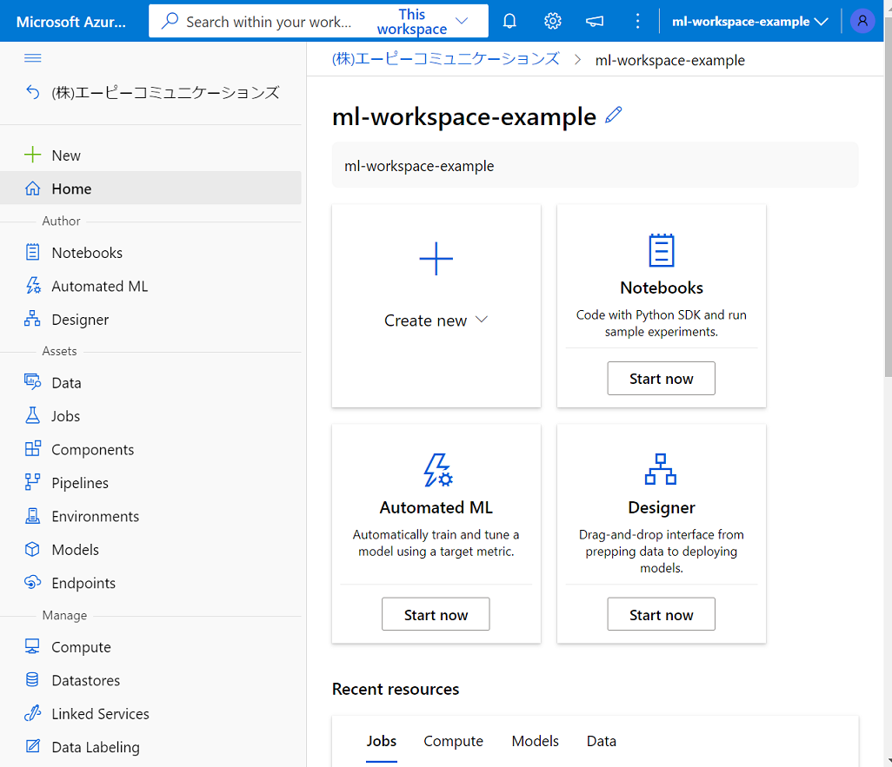

# azure で deep learning framework

沢山ある中からいくつか調べておきたい。

## TensorFlow
## Keras
## PyTorch
## Scikit-learn

# 自然言語処理 (NLP: Natural Language Processing)
## 用途
感情分析、トピック検出、言語検出、キーフレーズ抽出、ドキュメント分類

## Azureでのキーワード
Azure Cognitive Services
Azure Cognitive Services for Language　テキスト分析サービス
Azure Machine Learning
Spark NLP (これはPythonのライブラリのこと)
Azure Databricks (Spark NLP を使用した Spark サービス )
Azure Synapse Analytics (Spark NLP を使用した Spark サービス)  Azure HDInsight (Spark NLP を使用した Spark サービス) 

# Azure Custom Vision Service
画像分類のモデルの作成に利用可能。GUIから簡単に利用することができる。


# Azure Machine Leaning のはじめかた

## Azure Machine Leaning Studioとは？
（紛らわしいが）現在、ML Studio (classic) と Azure Machine Learning スタジオ　の２つがある。※(classic)のサポートが2024/8まで。

(これをやってみる)
https://learn.microsoft.com/ja-jp/azure/machine-learning/quickstart-create-resources

## Azure ML ワークスペース の作成

(linux)Machine Learning 拡張機能のインストール
```
curl -sL https://aka.ms/InstallAzureCLIDeb | sudo bash 
az extension add -n ml -y
```

Azure ML ワークスペース 作成
```
RG_NAME=az-example-python
LOCATION=japaneast
WORKSPACE=ml-workspace-example
#
az group create -n $RG_NAME -l $LOCATION
az ml workspace create -n $WORKSPACE -g $RG_NAME -l $LOCATION
```

※ 数分してから ブラウザで スタジオ Web URL へアクセスすると ワークスペースが利用できる。


作成されたワークスペース へ アクセスして 以下を作成します。
1. コンピューティング インスタンス (開発用に利用するコンピューター)
2. コンピューティング クラスター

## Notebook とは


## ワークスペースの作成


## 3つの機械学習モデルの作成方法
[Notebooks]
[自動 ML]
[デザイナー]

## コントロールスクリプト

hello.py を Notebooks から実行する　（ローカル実行）
```
print("Hello world!")
```

get-started/run-hello.py を実行する
```
tree -L 3
.
└── get-start
    ├── run-hello.py　※　subscription_id, resource_group, computeName　を指定
    └── src
        └── hello.py
```


```
tree -L 3 
.
├── pytorch-env.yml (Conda 環境ファイル)
├── run-hello.py ※Jobを送信するコントロールスクリプト
├── run-pyrorch.py ※Jobを送信するコントロールスクリプト
└── src
    ├── hello.py
    ├── model.py
    └── train.py
```


MLflow Tracking を利用したロギング
